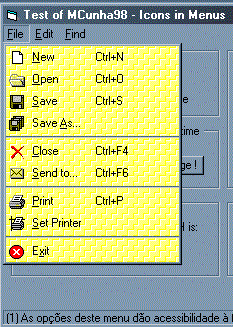



## mciconmenu

### Description

Put real icons in menus using this activex control. Very simple for use in your app !

For more details, visit www.mcunha98.cjb.net
 
### More Info
 

             |
---                |---
**Submitted On**   |2000-11-05 21:11:26
**By**             |[Mauricio Cunha](https://github.com/Planet-Source-Code/PSCIndex/blob/master/ByAuthor/mauricio-cunha.md)
**Level**          |Intermediate
**User Rating**    |4.6 (37 globes from 8 users)
**Compatibility**  |VB 6\.0
**Category**       |[OLE/ COM/ DCOM/ Active\-X](https://github.com/Planet-Source-Code/PSCIndex/blob/master/ByCategory/ole-com-dcom-active-x__1-29.md)
**World**          |[Visual Basic](https://github.com/Planet-Source-Code/PSCIndex/blob/master/ByWorld/visual-basic.md)
**Archive File**   |[CODE\_UPLOAD113701162000\.zip](https://github.com/Planet-Source-Code/mauricio-cunha-mciconmenu__1-12574/archive/master.zip)

